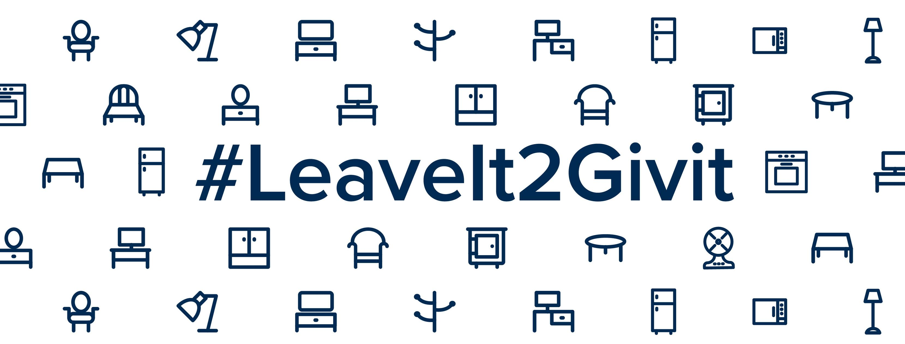
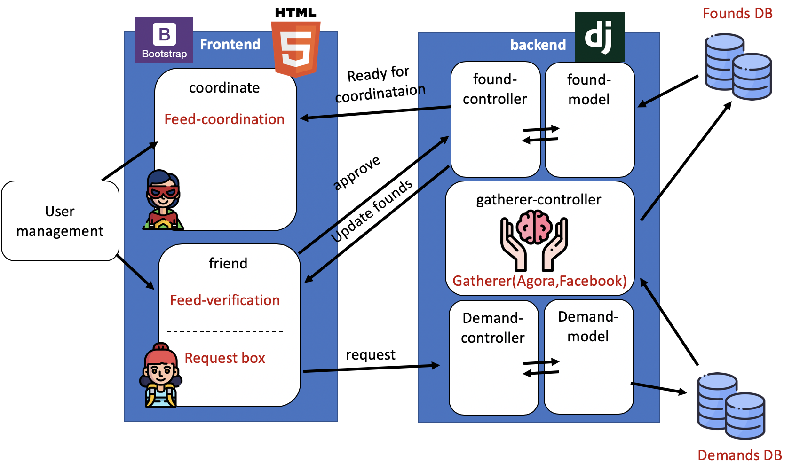

<div align="center">



</div>

# background & vision

“Givit”is a non-profitable organization which operated by IDC student and aiming to help economically struggling students(“friends”) by helping them to furnish their apartments.

Givit web-application will automate the procces of gathering our friends demands, findind the furniture online and get thier approval for coordinate and transfer.

# app components

<div align="center">



</div>

## Backend

implemted with Django the following components:

1. friend app: manage the friends requests anf the friends feed

2. Gatherer app:
   - automated system that will iterate the relevant sites(firat step Agora site second step facbook groups).
   - get requests from the Demand DB and updete the found DB.
   - operate details: we open vm in google cloud and using crontab run our script every hour, how create json file with our new searches.

3. coordinate app: manage the coordinations of approved items

## Frontend

implemented with bootstrap the following components:

1. friends:

   - private Feed - tracks the furniture which was found by the app, waits for the friend approval.
   - request box - a form which the friends will fill in order to request new items.

2. coordinte: track all the items that was approved by our friends.

## login system

- two users groups: friends, coordinates.

## CI/CD- 
- basic test for friendreq app- set up the machine and run:
```
   python3 manage.py test
```


# Getting started

These instructions will get you a copy of the project up and running on your local machine.

### Prerequisites

install:

- Download and Install [Vagrant](https://www.vagrantup.com/) and [Virtual Box](https://www.virtualbox.org/) on your local computer
- Clone/ Download the zip file from the givit repository to your local computer

### Initializing Project Groot Virtual Environment

A step by step series that tell you how to get Project givit up and running

1. Start the app:

```
   vagrant up
```

this command:
- spin the VM.
- set a virtual environment (pipenv).
- install all the dependencies using the pipfile.
- set the DB scheme.
- run on the background the givit server.

2. enter the app by open your browser and go to:
```
  http://localhost:8000/
```
now, as a default there exist in the system a super user with:
- user name = 'givit'
- password = 'givit'
if you want to cange them set the following environment variables:

DJANGO_SU_NAME="NEW_USERNAME"

DJANGO_SU_EMAIL="NEW_EMAIL"

DJANGO_SU_PASSWORD="NEW_PASSWORS'

3. When finished, tear down the environment using:

```
exit
vagrant destroy -f
```

# Dependencies

all the required dependencies are handled by the pipfile.
if you need to a new library:
```
  vagrnat ssh
   cd /vagrant/givitsite/
   pipenv shell
   pipenv sync
   pipenv install "LIBRARY_NAME"
```
# Set Timezone
for our Gatherer app we need to make sure that the timezone is set to ...
1. Before changing the time zone, you’ll need to find out the long name of the time zone you want to use. The time zone naming convention usually uses a “Region/City” format.

```
timedatectl list-timezones
sudo timedatectl set-timezone Asia/Jerusalem
timedatectl
```
# team members:

### -Rotem Ben Zvi

### -Nadav Shoshan

### -Matan Sinai

### -Tal kind

### -Lior Sidi
